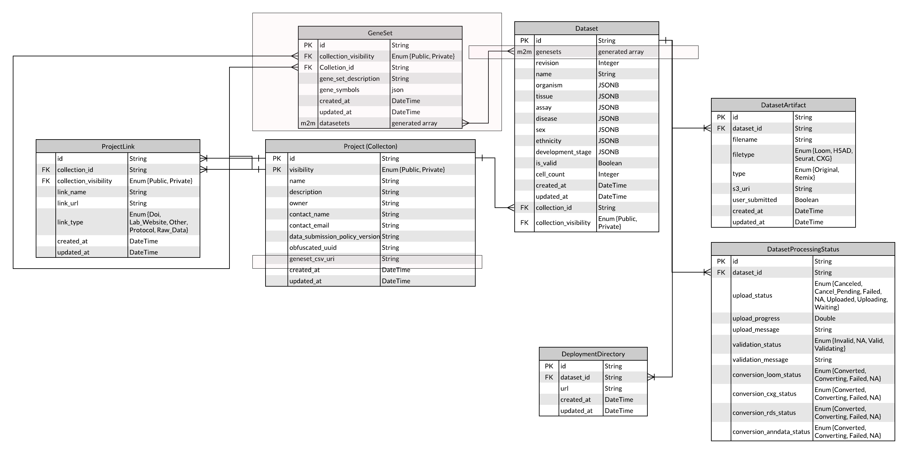

# Data Portal Gene Sets Design Doc

For background information see

[Product Requirements](https://docs.google.com/document/d/1UkNFskVTD__OSjYEewNgl1R4x107iPqGzvorHYsfjNA/edit)

[Cellxgene gene set REST API](https://docs.google.com/document/d/12Wce-r2OvLGnuUWm9abAiZuj-kELz_LYTEvv6KZLXXo/edit#heading=h.lny9vd25fbcp)

This is a working document summarizing updates to the data portal to support the creation and retrieval of gene sets. The feature and apis described will be used by both cellxgene (explorer) for the CZI hosted backend and the data portal. As such, the API must support the ability to:

- Read and write gene sets from the data portal for a collection or dataset
- Read gene sets from the explorer for a given dataset

Note that while this feature is in development it will be gated by a feature flag (the frontend will only display the relevant elements if `?gs=true`is included in the url.

The portal API will add three routes:

- /dp/v1/collections/{collection_uuid}/genesets
  - POST
  - GET
- /dp/v1/datasets/{dataset_uuid}/genesets
  - POST

It will also update existing APIs:

- the response object for /dp/v1/collections/{collection_uuid} to include [information about the gene sets](https://docs.google.com/document/d/1qs3gXeQPBdPQ5a0t_OYGKH_JxaU99GNXv8tq9qma2sM/edit#heading=h.8q9hb59niw3o) (id, name, description and linked_datasets) linked to a given collection.
- Action for collection deletion to include deleting all linked gene sets
- Action for dataset deletion to include deleting all links between the dataset and genesets

## Terms

- gene, gene name, gene ID - a gene identifier, encoded as a string, ie, FOXP2.
- geneset or "gene set"- a named & ordered collection of genes.
- genesets or "gene set collection" - an unordered collection of genesets.

## Data Structures

### Names & Symbols

Geneset names and gene_symbols must be a string, and will likely support only a subset of characters.

### Genesets CSV

Genesets in a CSV format, denormalized, with one (geneset,gene) pair per row, plus optional description for geneset and gene. All values are strings. The format is intended to be suitable for the user to read/write/edit with Excel or other tools, and upload through the dataportal geneset page (see figma). A CSV of the same format representing all genesets in a collection, or all genesets linked to a dataset is available for download from S3 (via the data portal UI for curators and directly via uri for the hosted explorer)

Format is a Tidy CSV with the following mandatory columns:

- gene_set_name
- gene_set_description
- gene_symbol
- gene_description

**gene_set_name** and **gene_symbol** must contain a string value - ie, must not be empty or null. The description columns may be empty, but are also string values. The file may contain additional columns, which will be stored as a dict of additional params {“column_name”: “value”} on the gene.

Where a geneset has multiple gene rows, and they differ in gene_set_description value, the description in the first row of the geneset will be used. For further notes on format and validation rules see [gene sets formats](https://github.com/brianraymor/single-cell-curation/blob/gene-sets-format/docs/gene_sets.md)

```csv
geneset_name,geneset_description,gene_symbol,gene_description,provenance
club.cell,Co-expressed in club cells,CCKAR,This gene encodes a G protein,Pubmed ID XYZ123
club.cell,Co-expressed in club cells,SCGB3A2,"Coding, assoc. with asthma",Pubmed ID ABC456
club.cell,Co-expressed in club cells,CYP2F2,Protein coding gene associated with metabolic processes,Pubmed ID DCF678
Macrophage,Co-expressed for macrophages,CD68,Critical to macrophages
macrophage,Co-expressed for macrophages,CD163,Also critical to macrophages
```

If additional fields are included, when present for a gene they will be stored as a dict of {header: value} .

### Genesets JSON

The genesets default JSON data structure, used by the portal front-end to save new genesets.

```text
{
  "genesets": [
    {
      "gene_set_name": "<string>",          # gene set name
      "gene_set_description": "<string>",   # gene set description/notes
      "genes": [                            # genes in the gene set
        {
          "gene_symbol": "<string>",        # gene identifier/name
          "gene_description": "<string>"    # description/note for this gene
          "additional_params" : {      # additional parameters in csv
  "Header": "value"
  }
        },
        ...                                 # additional genes
      ]
    },
    ...                                     # additional geneset
  ],
}
```

Geneset and gene order is significant, the cellxgene UI will attempt to render in this order. The data portal must preserve this ordering. **geneset_name** must be unique to the entire collection, and each **gene_symbol** in a geneset must be unique (ie, occur only once in a given geneset).

### Abbreviated Genesets JSON

The gene set and dataset tabs of the data portal collections page do not require gene level information so that will not be included with geneset information for a collection.

```text
[
  {
     "id": "<string>",           # gene set id
     "name": "<string>",         # gene set name
     "description": "<string>",  # gene set description/notes
     "linked_datasets": [        # list of ids of datasets linked to geneset
        datasest_id,
        ...
      ]
  },
  ...        # additional geneset
]
```

### Relational Database Updates

Geneset Table

- ID: String
- collection_visibility Enum (FK with collection_id)
- collection_id String (FK with collection_visibility)
- name String
- description String
- genes JSON
- datasets M2M relationship to datasets

Collections Table

- geneset_csv_uri String
- genesets Deriveved one2Many field

Datasets Table

- genesets M2M relationship to genesets

For context in data portal relational database structure [see diagram below](#data-portal-database)

Question for discussion - JSONB does not maintain the order of an array but JSON does. Would it be better to add the gene order (within the geneset) as a field on the gene dict and store it as JSONB for indexing/searchability? Or just store as JSON and migrate later if necessary.

## Authentication/Authorization

Only collection owners will be allowed to upload gene sets or link gene sets to datasets. Only private collections can add gene sets or update the links between gene sets and datasets

## Routes

All route names below should be prefixed by the standard API base URL, eg, "GET /foo" means "GET /dp/v1/foo".

### POST collections/{collection_uuid}/genesets

[Gene set empty state figma](https://www.figma.com/file/TKV4sJ00zWobEFkaNgklC3/Gene-Sets?node-id=25%3A367).

[Gene set upload figma](https://www.figma.com/file/TKV4sJ00zWobEFkaNgklC3/Gene-Sets?node-id=260%3A305).

[Gene set validation errors figma](https://www.figma.com/file/TKV4sJ00zWobEFkaNgklC3/Gene-Sets?node-id=329%3A250)

Validation of and conversion from the [Geneset CSV](#genesets-csv) to the
[Geneset JSON](#genesets-json) format will be done by the front end. The genesets will be sent to the backend and persisted in the database via this endpoint. After creating genesets in the relational database, a
[Geneset CSV](#genesets-csv) containing all of the genesets linked to the collection will be created and stored in s3 under the uuid of the collection with /geneset.csv as a suffix.

If this is the first set of gene sets uploaded for the collection the collection table will be updated with a link to the csv.

**Request Body**
The request body must be a properly formed [Geneset JSON](#genesets-json).

**Response**

- 200 - Success. The new genesets were saved. Returns [list of gene sets linked to collection](#abbreviated-genesets-json)
- 403 - Forbidden. Collection does not exist
- 403 - Forbidden. User not owner of collection
- 403 - Forbidden. Collection is not private
- 400 - Bad Request. Geneset name already in database.

### GET collections/{collection_uuid}/genesets

Returns a dict containing a link to the gene set_csv for the collection and a list of all genesets in a collection, including their gene information.

**Response**

- 200 - Success Returns

```text
{
  "presigned_geneset_csv_uri": "<string>"   # url to download geneset csv
  "genesets": [
    {
      "gene_set_name": "<string>",          # gene set name
      "gene_set_description": "<string>",   # gene set description/notes
      "genes": [                            # genes in the gene set
        {
          "gene_symbol": "<string>",        # gene identifier/name
          "gene_description": "<string>"    # description/note for this gene
          "additional_params" : {           # additional parameters in csv
  "Header": "value"
  }
        },
        ...                                 # additional genes
      ]
    },
    ...                                     # additional geneset
  ],
}
```

- 403 - Forbidden. Collection does not exist

### POST datasets/{dataset_uuid}/genesets

This endpoint is used to update the linkage between a dataset and gene sets. Multiple gene sets can be linked or unlinked to the dataset specified. After updating the linkage in the relational database, a

[Geneset CSV](#genesets-csv) containing all of the genesets linked to the dataset will be created and stored in s3 under the name of the dataset with /geneset.csv as a suffix For example s3://hosted-cellxgene-prod/003649a0-6d44-4494-bd16-6026350bd331/geneset.csv.

This will allow the explorer to use its knowledge of the dataset name/s3 uri to also find the gene sets to be displayed with the dataset.

If this is the first time gene sets have been linked to the dataset a DatasetArtifact representing the link will be created. Otherwise the updated_at field of the DatasetArtifact will be set to the current time.

**Request Body**

The request body is a dictionary containing a list of gene set ids to link to the dataset and a list to unlink. \

```json
{

    “add”: [geneset_id, . . .],

    “remove”: [geneset_id, . . .]

}
```

**Response**

- 200 - Success Returns [list of gene sets linked to the dataset](#abbreviated-genesets-json)
- 403 - Forbidden. Dataset does not exist
- 403 - Forbidden. Collection linked to dataset does not exist
- 403 - Forbidden. Collection linked to dataset is not private
- 403 - Forbidden. User not owner of collection linked to dataset
- 404 - Not Found. Add or remove lists reference genesets not linked to the collection
- 404 - Not Found. Add list references genesets already linked to the dataset
- 404 - Not Found. Remove list references genesets not linked to the dataset

A 404 implies the geneset or dataset cache stored by the frontend is out of sync with what is stored in the database and the frontend should clear the cache and re request the information.

## Gene set download

Gene sets will be available for download in the [Geneset CSV](#genesets-csv) format. It will be possible to download genesets individually, for a dataset and for a collection.

- Individual gene sets can be downloaded from the [gene set tab for a collection](https://www.figma.com/file/TKV4sJ00zWobEFkaNgklC3/Gene-Sets?node-id=188%3A4632). The frontend will convert the [Geneset JSON](#genesets-json) to the
  [Geneset CSV](#genesets-csv) format and download it to the users machine as gene_set_name.csv.
- The [gene set tab](https://www.figma.com/file/TKV4sJ00zWobEFkaNgklC3/Gene-Sets?node-id=188%3A4632) will also have the option to download all genesets in a collection. The user will have the option to download it manually from S3 through a curl script or automatically as collection_name\_\_gene_sets.csv
- The [dataset download modal](https://www.figma.com/file/TKV4sJ00zWobEFkaNgklC3/Gene-Sets?node-id=364%3A0) will have the option to download all genesets in a dataset. The user will have the option to download it manually from S3 through a curl script or automatically as dataset_name\_\_gene_sets.csv

## Alternatives considered

Dynamic generation of gene set csvs was considered for gene set download (for all gene sets associated with a dataset or collection)

However this method raises some concerns

- Issues for cellxgene explorer. The explorer currently only “knows” the dataset uri. Further connecting the two products will require some consideration. The simplest path would be a dataset lookup api, given the dataset name or path it would return the dataset and collection uuid. This solution would also require the creation of a GET endpoint for datasets/{dataset_uuid}/genesets in order to retrieve the geneset information. In addition to the data portal work, this would also require a not insubstantial amount of backend work to be done in the explorer and raises questions about how this would handle datasets that don’t exist in the data portal (such as the covid data)
- Dynamically generating the link creates the possibility of some user experience issues. How long would we persist the s3 object? What happens if a user gets a link to download the gene sets and then adds more gene sets? Would they expect the newly added genesets to be included in the file?

## Data Portal Database


