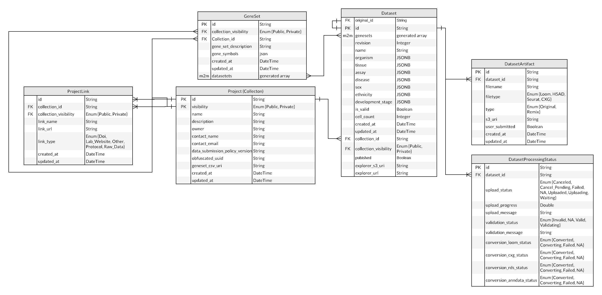

# Defining Communication between the Portal and the Explorer

## Metadata API

**Authors:** [Madison Dunitz](mailto:madison.dunitz@chanzuckerberg.com)

**Approvers:** [Trent Smith](mailto:trent.smith@chanzuckerberg.com), [Brian Raymor](mailto:braymor@chanzuckerberg.com), [Arathi Mani](mailto:arathi.mani@chanzuckerberg.com) [Bruce Martin](mailto:bruce@chanzuckerberg.com)

## tl;dr

The Explorer needs a way to gather data about a dataset, including what collection the dataset belongs to, that is not or can not be stored in the dataset cxg file. This requires allowing the explorer to look up information on a dataset based on its identifier via an endpoint in the portal API.

## Problem Statement | Background

Currently the Explorer doesn't know anything about the Data Portal. This keeps the coupling between the two systems loose, which is helpful. But we do need some level of integration and communication between the two services. Currently this is only possible in one place: in the metadata of the serialized cxg in the Explorer bucket.

The only information the Explorer has is the name of the s3 bucket passed in via the config and the dataset identifier passed in via the url. While it would theoretically be possible to grep for the Explorer url in the /collections API response in order to map back to the collection_id, this approach is fairly brittle and may not scale well.

Currently datasets are uploaded to the portal as part of a private collection, they are then converted to a variety of formats (h5ad, loom, rds, cxg) and stored in an S3 bucket for download or use by the Explorer. Additionally metadata about the dataset and the collection it belongs to is stored in a relational database. The owner of the collection can publish it, making it accessible through the cellxgene site.

When updating a public dataset (a dataset that belongs to a public collection, with publicized urls for viewing the datasets via the Explorer), it is currently necessary to overwrite the dataset in the S3 bucket in order to maintain the explorer urls, rather than simply redirecting to the new dataset location.

This also complicates the process of deleting a dataset that has been published, while still communicating any relevant information to the end user. If the dataset is simply deleted from S3, the explorer will have no knowledge of it, and when someone attempts to navigate to the Explorer page for the deleted dataset, it can only display a 404, after looking for the cxg in the s3 bucket and finding nothing there.

While newly created datasets are displayed in the Explorer under a url referencing their dataset uuid, historically created (but still supported) urls identify the datasets via the dataset names, further complicating references to specific datasets.

## Out of Scope
Updating information soted in the cxg (such as the dataset name) will require further discussion to determine if we will update the cxg or update the schema for the cxg (and address questions around backwards compatibility that would come with a schema update). Those questions and the accompanying work is out of the scope of this RFC. This RFC is specifically focused on unblocking the revision of collection level metadata that is not stored within the cxg/h5ad/loom files.

## Product Requirements

1. [Data consumers can easily discover the portal and other collections from cellxgene explorer](https://app.zenhub.com/workspaces/single-cell-5e2a191dad828d52cc78b028/issues/chanzuckerberg/single-cell/169)

1. [Data consumers can easily discover and review metadata for a dataset in cellxgene explorer](https://app.zenhub.com/workspaces/single-cell-5e2a191dad828d52cc78b028/issues/chanzuckerberg/single-cell/171)

1. [Curators may privately revise a published collection](https://app.zenhub.com/workspaces/single-cell-5e2a191dad828d52cc78b028/issues/chanzuckerberg/single-cell/36) with emphasis on Curators may update published datasets in the private revision of a published collection](https://app.zenhub.com/workspaces/single-cell-5e2a191dad828d52cc78b028/issues/chanzuckerberg/single-cell/141) and [Curators may delete published datasets in a private revision for a public collection](https://app.zenhub.com/workspaces/single-cell-5e2a191dad828d52cc78b028/issues/chanzuckerberg/single-cell/138)

## Detailed Design | Architecture | Implementation

#### Summary:
#### Deletion/Revisions (product requirement 3)
Create an alias tier between the Explorer and the Data Portal to allow for more flexibility in linkage between a url and a dataset. The explorer will use GET `datasets/meta?url={cellxgene_url}` to retrieve a link to the s3 object containing the dataset to display. This will require changes in both the portal and the explorer code base.

#### Seamless discovery (product requirements 1 & 2)
Create an alias tier between the Explorer and the Data Portal to allow for clarity in linkage between an explorer url and a collection. The explorer will use GET `datasets/meta?url={cellxgene_url}` to retrieve the collection id for the dataset. It will then use the existing GET `collections/{collection_uuid}` endpoint to retrieve metadata about the collection, including links to other datasets in the collection.

### Portal Changes

- Add an endpoint to the portal to look up the given url in the explorer_url field for datasets linked to both private and public collections and return

  - collection_id
  - explorer_s3_uri
    - Note: If the explorer_url field is not present in the database, return an S3_uri computed based on the explorer_url
  - Dataset tombstone status
  - Contact information (for withdrawn by contact message on deleted datasets)

- Add field explorer_s3_uri to the dataset table (string)
- Modify field deployment_directories (JSON) to be explorer_url (string) and index this field. (This will also require updating code throughout the data portal (front and backend) and the uploader where this field is referenced)
- Update creation of a dataset revision to create a separate explorer_url
- Update revision publication to tombstone deleted datasets, update explorer_url for refreshed datasets

For performance the explorer_s3_uri will be cached with a ttl measured in minutes to avoid unnecessary api calls but still allow updates to a dataset to quickly propagate out.

### Explorer Backend Changes

- Add logic to use the portal endpoint to get the cxg url based on the dataset identifier (rather than using the route information and the url to get the dataset directly from S3)
- Pass the cxg url to the DataAdaptor and follow the current logic patterns.

### Authentication/Authorization

Open question - will this endpoint be available to everyone or only the cellxgene application? If external users have access to the endpoint we will want to consider long term backward compatibility. Additionally we will want to ensure that the no private information is available through the route (or that we require authentication -- creating special permissions for the explorer)

### Routes

All route names below should be prefixed by the standard API base URL, eg, "GET /foo" means "GET /dp/v1/foo".

### GET meta/datasets?url={cellxgene_url}

**Response**

```json
{
  "dataset_id": "uuid",
  "collection_id": "uuid",
  "explorer_s3_uri": "string",
  "tombstoned": false
}
```

### Data model

Update dataset table (in Portal)

- [add] explorer_s3_uri
- [modify] deployment_directories -> explorer_url (update from a list to a string and set the first value of the list as the string for existing datasets). Index this field.

There are no necessary updates to the Explorer data model

See [below](#data-portal-relational-db) for updated database diagram

### Test plan

To ensure this feature is working correctly we will add end to end tests covering both the data portal and the explorer, stepping through the process of creating a revision, refreshing a dataset, publicizing the revision and then accessing the updated dataset (via the original url) in the cellxgene explorer.

## Alternatives

The main drawback of the plan described above is that it will prevent self hosting the czi hosted version of cellxgene (unless users are willing to build out their own data portal/api). However they will be able to continue to host the desktop version.

Other alternatives considered include

- Overwriting files in S3 to maintain the cellxgene urls
  - This was tested with a sample dataset it took ~100 seconds for an avg sized dataset. Also if we are copying the updated dataset to overwrite the existing one, error handling will be important/challenging to ensure we dont end up with a dataset that is a mix of the old and new files
- Creating html templates with information regarding deleted datasets and storing them in s3 under the original dataset path
- Passing the collection id as part of the cxg
  - Although the collection_id should be fairly static, this will make updates more difficult/time consuming, doesnt solve the larger communication problem and will involve storing data in multiple places.
- Connecting cellxgene to the explorer database
  - This will further complicate and obscure the boundary between the two repos and create dependencies around the shared orm as well as potential security concerns
- Add a table hardcoding the mapping between dataset name and dataset id for the datasets use names rather than uuids in the cellxgene url path.
   - This would add complexity to the code, particularly since the mapping would differ between environments
   - This would not solve the deletion/replacement issue.

However the explorer will still need to be updated to handle deleted datasets and support breadcrumbs linking back to the data portal which create the same issue concerning self hosting.

Another option considered is creating a separate API for this information to avoid making this endpoint available to users via the regular api. If external users are aware of and dependent on this API we will need to consider backwards compatibility when making changes to the API to support new features in cellxgene. However as long as we are not publicizing the APIs or making any promises concerning their functionality or availability, this endpoint can be added to the existing API.

## Data Portal Relational DB


