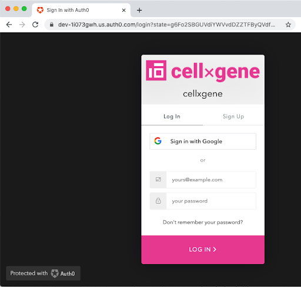

# Authentication in Data Portal and Cellxgene 

**Authors:** [Brian McCandless](mailto:bmccandless@chanzuckerberg.com)

**Approvers:**
[Timmy Huang](mailto:thuang@chanzuckerberg.com),
[Trent Smith](mailto:trent.smith@chanzuckerberg.com),
[Arathi Mani](mailto:arathi.mani@chanzuckerberg.com),
[Colin Megil](mailto:colin.megil@chanzuckerberg.com),
[Eduardo Lopez](mailto:elopez@chanzuckerberg.com),
[Ambrose Carr](mailto:acarr@chanzuckerberg.com)

## tl;dr

This document describes the authentication process for Data Portal and
Cellxgene to address the immediate needs of M1, which is to support user
annotation in cellxgene.

## Change Log

Oct 1: Converted from Google Doc

## Problem Statement | Background

1. The scope of this document is to establish user identity; authorization is
   not part of this design.
1. The document describes authentication in both Data Portal and cellxgene and
   how they work together. The only feature that currently requires authentication
   in milestone 1 is the user annotation feature in cellxgene.
1. This document assumes that Auth0/OIDC/OAuth will be the technologies used
   for authentication, alternative authentication services are not considered
   here.
1. Cellxgene will continue to support the desktop stand alone version, the WSGI
   hosted version, and the CZI hosted version. Cellxgene must continue to work
   in all these modes. Nothing in this design breaks backwards compatibility or
   changes current user experience.

## Product Requirements

Cellxgene

1. [CXG1] The cellxgene client will provide an authenticated user with access
   to features that require authentication (just user annotations for now).
1. [CXG2] An authenticated user will have the option to logout.
1. [CXG3] An unauthenticated user will not have access to features that require
   authentication. They will be disabled in the app, and require login on first
   use.
1. [CXG4] An unauthenticated user will have an option to login
1. [CXG5] A user must not unexpectedly lose work (state of the client) when
   they login. Normally when a cellxgene dataset is accessed, there is a page
   reload, which presents the user with the initial state. Many authentication
   flows use a redirect, which would also reset the cellxgene state back to the
   initial state.
1. [CXG6] The cellxgene server will enforce the authentication for routes that
   require authentication by checking for the ID token, and rejecting requests
   that lack a token or have an invalid/expired token. The signature needs to be
   validated to ensure that the token has not been tampered with. An expired ID
   token can be refreshed (as long as the refresh token has not expired).
1. [CXG7] The cellxgene server will have an endpoint to check if the requestor
   is authenticated. The current (“config”) endpoint can serve this purpose by
   having an authentication section.
1. [CXG8] To avoid causing the ID token to expire while the user is working
   (and thus disrupting the user’s work), the token can be automatically refreshed
   when the ID token expires. The
   expiration date of the Refresh token could be set to the maximum of 30 days.
1. [CXG9] cellxgene must continue to support the desktop stand alone version
   and the WSGI hosted version. Authentication is a new feature that can be
   optionally configured for cellxgene
   deployments. If cellxgene is not configured for authentication then the login/logout buttons
   will not appear, and feature such as user-annotations will be controlled as they have been
   with configuration parameters (e.g. “user_annotations.enable”).
1. [CXG10] The cellxgene client code must not require a particular solution
   (i.e. Auth0). Auth0 code must not be added directly to the cellxgene client.
   Any such specialize code must be
   introduced using the modularity features of cellxgene. (In the design presented here there is
   no need to have such specializations in the cellxgene client).
1. [CXG11] The cellxgene server must not require any authentication specific
   modules to be installed if authentication is not configured. The cellxgene
   server may provide Auth0
   support as a configuration option, but anything specific to the deployment
   (client_id, client_secret, etc), must be configurable and not part of the code base.

Data Portal

1. [C1] An authenticated user will have the option to logout
1. [C2] An unauthenticated user will have an option to login

Single sign on

1. [S1] A user authenticated in cellxgene will automatically be authenticated by Data Portal
1. [S2] A user authenticated in Data Portal will automatically be authenticated by cellxgene
1. [S3] Logging out of one app, logs the user out of both apps

General

1. [G1] GDPR requirements: For gdpr, the main thing we need to log is user id + time stamp for
   when they first agreed to our terms of service. The underlying requirement is we need to log
   evidence of consent, ie the "click" of agreement to our tos.
1. [G2] The login experience requires that the user has consented to use cookies. It is assumed
   that this question has already been asked, and we first verify the answer before proceeding
   with the login process.

## Detailed Design | Architecture | Implementation

### Authentication Approach

1. OAuth2: an authorization standard that allows a user to grant limited access to their
   resources on one site, to another site, without having to expose their credentials.
1. OpenID Connect (OIDC): an identity layer on top of OAuth2.
1. Json Web Tokens (JWT): a compact and self-contained way for securely transmitting
   information between parties as a JSON object. This will be used to store user identity information.
1. Auth0: A flexible drop in solution to add authentication and authorization services. Uses
   industry standards like OAuth2, OIDC and JWT. [https://auth0.com/docs/getting-started/overview
   ](https://auth0.com/docs/getting-started/overview)
1. Identity providers: Initial set includes the following in priority order: Google, Github,
   ORCID, Facebook, Email. We may provide a “contact us” link on the authentication landing page
   to let the user request another identity provider.

### Single sign on

Single sign on means that a user can login into either Data Portal or cellxgene, and
automatically be logged into the other. Or they can log out of one, and automatically be
logged out of the other.

This will be achieved by using an httpOnly sameSite cookie, using the same domain for both
backends. Both applications will use the same Auth0 client id and domain. Auth0 will be
configured to register a callback to each of the two applications. A cookie setup this way
will be sent to the backend of both Data Portal and cellxgene during API requests. Both
applications will set this cookie on login, and remove it on logout.

For best security, both applications should use the same full domain name so that we may use the
“sameSite=strict” option on the cookie. For example: api.cellxgene.cziscience.com. This will
keep the two applications isolated. The API to each application can be distinguished using a
different directory within that domain:

Front-end:

1. cellxgene: cellxgene.cziscience.com/&lt;urlroot>/&lt;datasetname>/...
1. Data Portal: cellxgene.cziscience.com/

Back-end:

1. cellxgene: api.cellxgene.cziscience.com/cellxgene/...
1. Data Portal: api.cellxgene.cziscience.com/corpora/

CloudFront (or any http proxy) can be configured to map the cellxgene API from the “api
.cellxgene.cziscience.com/cellxgene/&lt;the_rest>” to its actual location on the server
“cellxgene.cziscience.com/&lt;the_rest>”.

Note: This setup will require a minor change to cellxgene, since it currently makes an
assumption that the client and backend are at the same base url.

### Authentication in Cellxgene

#### User Experience

The following assumes that:

1. cellxgene has been configured to use authentication.
1. user annotations have been enabled in the configuration, and configured to require user
   authentication.

When an unauthenticated user visits a dataset page:

1. a “Login” button will be displayed near the top of the page.
1. A message will noticeably pop up to inform the user that if they intend to use user
   annotations (or other features requiring authentication) they should log in now. The message
   may go onto explain that logging in later will reset the web page. The message may then
   have a “Login” or “Dismiss” button. If they click “Login”, then this is equivalent to
   hitting the Login button from step 1. If they click Dismiss, then they will not be asked
   to login (if they later do work in the client, and then choose to login, their work will
   be lost). We may decide to remember the user’s choice to dismiss, so as not to
   repeatedly ask them each time (assuming they have agreed to accept cookies). The
   details described above should be taken as a suggestion, the actual user experience
   may be different in detail.
1. UI elements that require authentication are disabled (greyed out). For user annotations this
   includes the “Create new category” button, and the options to export or import user annotations.
1. When the user clicks the “Login” button the authentication flow starts.

When an authenticated user visits a dataset page:

1. A Logout button will be displayed at the top of the page
1. [Optional] we can tell the user who they are logged in as. This information can be made
   available in the configuration parameters (from the “config” endpoint).
1. The “Create new category” button is available, as well as UI elements to export and import
   annotations files, and any other UI elements that require authentication.
1. When the user clicks the “Logout” button, the logout flow starts.

Backward compatibility: If the annotation feature has been enabled, but authentication has not
been enabled, then the behavior is like the current cellxgene with annotations enabled. In this
case, there are no login/logout buttons. The user id is generated from the session id, and it
has no meaning outside of the current browser.

#### Login Flow

The flow is similar to “regular app” flow in the auth0 documentation. The “Web App” is the
cellxgene server in the diagram.

Tl;dr: The following section goes over the above diagram, as it relates to cellxgene, and
contains additional steps about storing the id_token in an httpOnly cookie so that user
identity can be safely stored and sent back to cellxgene on each request.

The process: numbers in square brackets refer to steps in the above diagram.

- The login request. The client sends a request to the “/login” endpoint of the cellxgene
  server. The request contains the location to the current dataset which will be used to
  redirect the user back at the end of the process. The location can be path within the current
  server (e.g. “/d/pbm3ck.cxg).
- **[1]** The cellxgene server then initiates the authentication request by redirecting the
  browser to the Auth0 Universal Login Page. This is a full page navigation to the Auth0 czi
  science tenant. The image below shows what that looks like. The cellxgene server has been
  configured with a callback url, client_id, domain, client secret, and possibly other
  parameters needed for authentication. It initiates the authentication request with these
  parameters. The state variable that includes the current url of the dataset is attached to
  the request.
- **[2]** Auth0 has redirected the user to an auth0 provided login page (which can be branded
  with Cellxgene logos). The user can authenticate with an identity provider (like Google or others).

- **[3]** Once the user has authenticated, Auth0 will direct the browser to the callback url
  in the cellxgene server. The callback url must be known to both Auth0 and to cellxgene. I
  suggest a name like “/oauth2/callback”. The request will contain the authorization code.
- **[4]** cellxgene can then exchange the authorization code for an ID token by sending a back
  channel request to Auth0. Cellxgene must know the client_secret for this step. Part of the
  configuration and startup process for cellxgene will be to retrieve this secret. In the case
  of CZI hosted cellxgene the client_secret will be retrieved from the AWS Secrets Manager.
- **[5]** Auth0 will send back the ID token, as a JWT (JSON Web Token).
- The cellxgene server then redirects (full page nav) the user back to the original dataset
  , and directs the client to save the JWT in an httpOnly cookie on the client.
- The JWT proves the identity of the client. Subsequent requests from the client to the
  cellxgene server will include the cookie with the JWT. When the cellxgene client re-requests
  the configuration through the dataset’s “config” endpoint (&lt;server>/d/&lt;datasetname>/api
  /v0.2/config), the configuration will now indicate that the user is authenticated. The
  cellxgene client can also have access to the user’s name, which it may use when displaying the log information.
  1. If the ID token is invalid, then the cellxgene server can re-initiate the authentication
     process by going back to step [1]
  2. The server will verify the signature of the token to ensure that it was signed by the
     sender and not altered.
  3. If the ID token is expired, then the server will obtain a new ID token automatically
     using the Refresh token. It will then save the new ID token in the cookie.
- When the dataset’s “schema” (&lt;server>/d/&lt;datasetname>/api/v0.2/schema) endpoint is
  accessed from the cellxgene client, it will now include information about the user’s previously
  created user annotations (if any).

#### Logout flow

The Logout flow is much simpler.

- A request is sent to the to the “/logout” endpoint in cellxgene
- cellxgene redirects back to the current page, with a directive to delete the cookie containing the JWT.

#### Application Endpoints

To support the Auth0 authentication, following endpoints are needed by cellxgene. These endpoints were referenced in the previous sections, and defined here in more detail.

Note: If authentication is not enabled, then these endpoints will not be present (e.g. they would all return 404 errors).

- /login : this endpoint is used to initiate the login process. The client passes in the
  location to the current dataset in the request. The server then initiated the authentication
  request by redirecting the browser to the Auth0 universal login page. The server passes in the
  location of the dataset as a state variable in the request, so the browser can be redirected
  there after login. This is step 1 in the diagram. /login is requested when the user clicks on
  the “login” button.
- /logout : this endpoint is used to clear the authentication credentials. The cookie
  containing the ID token is removed. /logout is requested when the user clicks on the “logout” button.
- /oauth2/callback: this endpoint is accessed during step 3 of the diagram. Auth0 redirects
  the user to this endpoint, and the request contains the authentication code and the state
  parameter sent in from the /login endpoint. The cellxgene server then exchanges the
  authentication code for an ID Token. Once complete, the cellxgene server redirects the client
  back to the dataset, and directs the browser to store the ID Token in a cookie.

### Authentication in Data Portal

When a user visits the Data Portal site, we determine if the user is authenticated or not by
querying a backend endpoint (e.g. api.cellxgene.cziscience.com/corpora/is-authenticated). This
can return back the username if authenticated, or a null response if not authenticated.

If authenticated, a Logout button may appear near the top of the page.

If unauthenticated, a Login button may appear near the top of the page, with the name of the user.

In a previous version of this design doc, the authentication strategy for Data Portal was to use
the [Authentication Code Flow with Proof Key for Code Exchange (PKCE)](https://auth0.com/docs/flows/concepts/auth-code-pkce),
implemented in the client side. This has now been changed to
using the Authentication Code flow in the backend (same as cellxgene). This approach is
simpler with respects to the single sign on strategy. It avoids a step where the client
needs to access the server to set the cookie containing the tokens. It is also more secure.

The Data Portal front end requires backend support for the following endpoints

- Login: start the authentication flow, set the cookie when complete
- Logout: logout, remove the cookie
- Is-authenticated: check if authenticated, and return user information

#### Data Portal Backend Options

There are three implementation options for these endpoints

1. Data Portal could use the cellxgene API to implement these. This is simple because it
   requires almost no work for the Data Portal. However, it creates a tight coupling between the
   two deployments. If cellxgene went down, then users could not log into Data Portal. There is
   also a dependency between the code versions since Data Portal would require this interface to
   exist and not change in cellxgene.
2. Data Portal implements this in the backend. There are only a few endpoints to implement, and these are not difficult or long.
3. Data Portal uses parts of the [fusillade](https://github.com/HumanCellAtlas/fusillade)
   project related to authentication. The code is already written and tested. Fusillade will
   need to be adapted in small ways (to set cookies, for example). The API for fusillade is
   described here: [https://auth.data.humancellatlas.org/](https://auth.data.humancellatlas.org/) in the section labeled oauth.

Option 2 is the best choice. The amount of coding is small enough when using libraries like authlib.

### Future Work

The following lists possible work that can be done after the design described above has been implemented.

1. if the user has declined cookies, we could (with some work), still enable a temporary login
   while the user remains on the current page. Single sign one would not work in this case. I’m
   not advocating for this option.

## Alternatives

### Cellxgene could use a client side approach such as authorization code with proof key code exchange (PKCE)

The login/authentication approach described in the cellxgene section uses the more secure
Authorization Code grant type (response_type=code). This flow requires extra steps (steps [4]
and [5] in the diagram), where the authorization code is exchanged to an ID token by making a
request from the cellxgene server to the Auth0 server.

An alternative is to use the authorization code with proof key code exchange (PKCE). This is
the approach you might use in a single page app where you do not want the code running in a user’s
browser to have access to the auth0 client secret.

This approach also requires a page navigation to the Auth0 Universal Login page, so it also
loses any client side data through the login process.

Therefore both approaches amount to about the same thing in terms of user experience and
security (although technically the regular app authorization code is more secure); the choice
is more about where the authentication feature is initiated / implemented: The cellxgene server
or the cellxgene client. I prefer the cellxgene server approach for the following reasons:

1. In the client approach, more configuration parameters (client_id and domain) are needed by
   the cellxgene client
2. More specialized code is needed on the cellxgene client to start the authentication flow.
   Keeping with the modular goals of cellxgene, this code would need to be implemented in a way
   where it would not require auth0, but could be done in an authentication neutral way. This
   could be implemented using the customization features in cellxgene (inline_scripts), or some
   other way. The point being that there is a little more complexity with this approach, and I am
   unaware of benefits over the server side approach.
3. Keeping the authentication in the server could make it easier to support different types of
   clients. Currently the only client is the cellxgene browser client. In the future there could
   be an api client that accesses cellxgene programmatically through its REST api.

### Cellxgene could use a popup approach that does not require a page navigation

Auth0 provides a popup approach that avoids the page navigation to the Auth0 Universal Login
page. This has the advantage that the client side state of cellxgene is not reset during the
login process. This is very appealing since it makes the user experience nicer.

However, the popup approach is intrinsically not as secure. It uses the Implicit Grant Flow,
which is now longer recommended
([https://tools.ietf.org/html/draft-ietf-oauth-security-topics-09#section-2.1.2](https://tools.ietf.org/html/draft-ietf-oauth-security-topics-09#section-2.1.2)):
“The implicit grant (response type "token") and other response types causing the authorization
server to issue access tokens in the authorization response are vulnerable to access token
leakage and access token replay as described in [Section 3.1](https://tools.ietf.org/html/draft-ietf-oauth-security-topics-09#section-3.1), [Section 3.2](https://tools.ietf.org/html/draft-ietf-oauth-security-topics-09#section-3.2), [Section 3.3](https://tools.ietf.org/html/draft-ietf-oauth-security-topics-09#section-3.3), and [Section 3.6](https://tools.ietf.org/html/draft-ietf-oauth-security-topics-09#section-3.6). In order to avoid these issues, Clients SHOULD NOT use
the implicit grant and any other response type causing the authorization server to issue an
access token in the authorization response.”

The popup experience may also depend on the client’s browser and security settings, which could
lead a larger testing and support burden.

So, the consensus was to go with the “regular app” approach, and strongly encourage the user to
login before doing work.

## References

[0][location to the authorization code flow diagram](https://auth0.com/docs/architecture-scenarios/web-app-sso/part-1)

[1][auth0 docs](https://auth0.com/docs/)

[2][authentication code flow with proof key for code exchange (pkce](https://auth0.com/docs/flows/concepts/auth-code-pkce))
