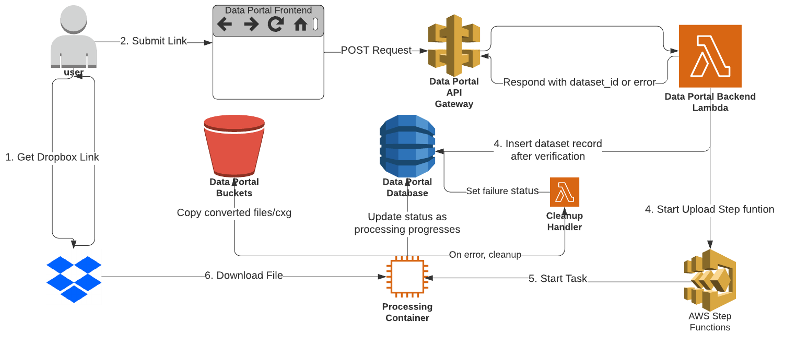
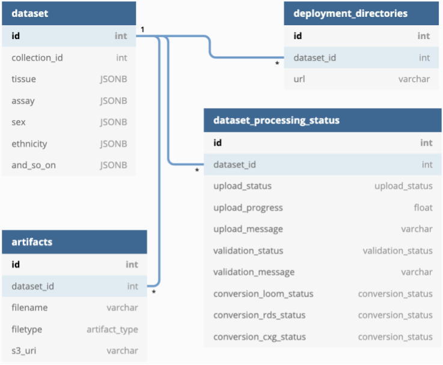

# User Upload and Validation From Dropbox

## For the cellxgene Data Portal

**Authors:** [Trent Smith](mailto:trent.smith@chanzuckerberg.com)

**Approvers:** [Arathi Mani](mailto:arathi.mani@chanzuckerberg.com), [Timmy Huang](mailto:thuang@chanzuckerberg.com),
[Marcus Kinsella](mailto:mkinsella@chanzuckerberg.com), [Eduardo Lopez](mailto:elopez@chanzuckerberg.com), [Brian Raymor](mailto:braymor@chanzuckerberg.com)
[Ryan King](mailto:ryan.king@chanzuckerberg.com), [Brian McCandless](bmccandless@chanzuckerberg.com)

## TL;DR

By supplying a Dropbox link, a user can initiate all the steps of dataset addition to the Data Portal (DP): upload,
validation, conversion to different formats, and insertion into the database.

## Background

One of the primary goals of the DP is to allow users to contribute their own datasets that follow the cellxgene Remix
Schema. The first step in contributing a dataset is uploading the file in which the dataset is serialized. These files
can vary in size from a few MB to tens of GB. Users often already keep these files in cloud storage so they can share
them with collaborators, so a natural initial upload source is a cloud storage service like Dropbox.

After upload, additional processing is required before the dataset is available in the DP. The uploaded dataset file
must be validated against the schema, and the file needs to be converted to other common single cell analysis formats.
Information needs to be extracted from the dataset and inserted into the DB database along with the locations of all the
dataset files.

These steps require the orchestration of compute and storage resources. And all of these steps are prone to errors,
including some that the user can correct. So the DP needs infrastructure that handles automated processing and error
reporting for uploaded datasets.

## Product Requirements

**A. Upload**
1. A user can upload a file to DP using a [shared link](https://www.dropbox.com/features/share/link-sharing) from their Dropbox.
1. A user can initiate an upload from the DP Browser App.
1. A user can abort an upload from the DP Browser App.
1. A user can check the status and progress of their upload from the DP Browser App.
1. A user can restart a failed upload from the DP Browser App.
1. The user must be authenticated before uploading.
1. A user who has not yet agreed to the Portal policies must not be able to upload their file.
1. Users must first create a "collection" in the DP Browser which will contain the uploaded dataset before they
   can start an upload.

**B. Validation and Conversion**
1. Uploaded files that fail validation because they do not follow an accepted
   [schema](https://github.com/chanzuckerberg/corpora-data-portal/blob/main/backend/schema/corpora_schema.md) and
   [encoding](https://github.com/chanzuckerberg/corpora-data-portal/blob/main/backend/schema/corpora_schema_h5ad_implementation.md)
   must not create a valid dataset in the DP.
1. When a file fails validation, the user must receive information on why validation failed and steps that can be taken to
   correct.
1. The uploaded file must be converted to all the other datasets that the DP supports. Presently, these are AnnData,
   Loom, and Seurat objects serialized as an RDS file.
1. When validation and conversion are complete, the dataset should appear in the DP Browser in the correct collection
   context along with metadata fields read from the dataset, for example assay and tissue.

### Nonfunctional requirements

1. Uploads from Dropbox will retry if they fail. Retry at least 5 times with an exponential back off.
1. A user can upload a single file up to 30GB in size. This is roughly the largest file observed so far, and we expect
   that larger files will be rare.
1. Shared links referring to more than one file will be rejected.
1. The status of an upload must be tracked and queryable.

## Detailed Design

### Architecture Diagram

Components and flow.

### Database Schema

  

Database schema.

There are four tables that contain information about dataset. The main table is `dataset` which has the `dataset_id` as
its primary key. It associates the dataset with a collection, and contains dataset attributes like tissue and assay that
enable richer display in the DP.

The `artifacts` and `deployment_directories` track locations of downloadable files and cellxgene Explorer deployments,
respectively.

The `dataset_processing_status` table tracks processing as it progresses and has fields that statuses, progress, and
messages for the upload, validation, and conversion processing steps.

The status fields in the `dataset_processing_status` table are enums:

**upload_status**
| Values         | Description                                                                                 |
| -------------- | ------------------------------------------------------------------------------------------- |
| Waiting        | The upload is enqueued, and waiting for the upload container.                               |
| Uploading      | The file is actively being uploaded.                                                        |
| Uploaded       | The upload was completed successfully.                                                      |
| Failed         | The upload has failed. A new link or file must be uploaded. Any upload progress is deleted. |
| Cancel Pending | The upload is in the process of being canceled.                                             |
| Canceled       | The upload has been canceled. Any upload progress is deleted.                               |

**validation_status**
| Values         | Description                                                                                 |
| -------------- | ------------------------------------------------------------------------------------------- |
| Validating     | The validation script is running.                                                           |
| Valid          | The uploaded file successfully passed validation.                                           |
| Invalid        | The uploaded file failed validation.                                                         |

**conversion_status**
| Values         | Description                                                                                 |
| -------------- | ------------------------------------------------------------------------------------------- |
| Converting     | The conversion script is running.                                                           |
| Converted      | Conversion completed and the file was copied to the DP bucket.                              |
| Failed         | Conversion failed.                                                                          |

### Flow Description

#### 1. Generate Shared Link on Dropbox Site

The user must [generate](https://help.dropbox.com/files-folders/share/view-only-access) a shared link from their Dropbox.
Shared links should only point to a single file, not a directory of files. Shared links from Dropbox should look like

`https://www.dropbox.com/s/abc123/my_dataset.h5ad?dl=1`

#### 2. Submit Shared Link Via DP Browser

Per the functional requirements, the user must be authenticated, have created a collection, and agreed to DP data
policies before being able to upload a dataset.
Users will paste their Dropbox shared link into the DP Browser, which will then make a
[POST request to /collections/{collection_id}/upload/link](#post-collectioncollection_iduploadlink) with the Dropbox
link in the request body. The DP Browser can expect a response with a _dataset_id_ that identifies the new dataset and
can be used to check its status. In the alternative, if the request fails the backend will return an appropriate error
code and and error message in the response body.

#### 3. Verify Dropbox Link

The POST request above is handled by an AWS Lambda that will perform some verification of the submitted Dropbox link.
To prevent [server side request forgery](https://owasp.org/www-community/attacks/Server_Side_Request_Forgery) the Lambda
will match the link against a regex that checks the expected Dropbox domain and link structure.

Also, the links generated by Dropbox are sometimes not direct links to the files. The query parameter `dl=1`
[may need to be added](https://help.dropbox.com/files-folders/share/force-download) so the link is direct.

#### 4. Update Database and Start Step Function

Once the link has been verified, the DP Portal backend will create a new record in the `datasets` table with a new
_dataset\_id_ primary key. It also creates a new record in the `dataset\_processing\_status` table, and sets `upload\_status`
to Waiting. The new _dataset_id_ is included in the response to the POST request that triggered the Lambda.

The backend then kicks off the processing AWS Step Function, including the Dropbox link and the new dataset_id as input
parameters. The Step Function will handle retries and errors. Finally, the Lambda sets the `upload_status` of the new
dataset to "Waiting".

#### 5. Start Step Function Task

The [Step Function](#processing-step-function) has a single task that runs a container that is responsible for retrieving the dataset file
from Dropbox, validating it, converting to different formats, and updating the database.

#### 6. Download File from Dropbox

Once the container starts, it sets the `upload_status` to "Uploading". Then,
the shared link is used to download the file from Dropbox into the container. Dropbox offers a way to validate the integrity of a download
by providing a hash of the data, for example [Dropbox Content Hash](https://www.dropbox.com/developers/reference/content-hash).
As the data is downloaded, the hash of the file will be calculated as it arrives. For calculating the checksum while downloading,
[checksumming_io](https://github.com/HumanCellAtlas/checksumming_io) can be used. If the final hash does not match,
then the download process will be retried.

While downloading the file, the container will periodically check if the job has been canceled using the upload
table. If the upload status is _Cancel Pending_, the upload container will stop the stream, delete any data that has been downloaded,
and set the status of the upload to cancelled.

Periodically, the progress of the download will be calculated and updated in the upload table.

#### 7. Validation and Conversion

If the download from Dropbox is successful, the `upload_status` is set to "Uploaded" and the `validation_status` is set
to "Validating".

The container (the same container that just downloaded the file from Dropbox), then runs the `cellgene schema validate`
command on the file. If that has non-zero exit code, `validation_status` is set to Invalid, stdout from the command is
inserted into `validation_message`, and execution halts. Otherwise, `validation_status` is set to "Valid".

Next, metadata values from the file are read and used to update the row in the `dataset` table.

Finally for each target conversion format, a script will be run that produces the format from the downloaded file. As
each new file is created:

- The appropriate `conversion_status` field will be updated to "Converted"
- The file will be copied to the DP S3 bucket. The [Content-MD5 header](https://docs.aws.amazon.com/AmazonS3/latest/API/API_PutObject.html#API_PutObject_RequestSyntax)
  will be used when copying to S3 to verify the integrity of each chunk.

#### 10. Update

Once all the files have been copied to S3, the `artifacts` and `deployment_directories` tables will have rows inserted
that refer to the new files and their locations in S3. At this point, processing is complete.

#### 11. Failed Processing

If the upload is retried and fails enough times(see Retry section) during upload or fails with an error that a retry
will not fix, it will be cleanup by the upload cleanup handler. Cleanup involves removing the upload from storage and
updating the upload table with the _Failed_ status.

##### Why Might the Upload Fail

- The downloading server crashed.
- Dropbox experienced an outage.
- The user has reached their [daily bandwidth allowance](https://www.dropbox.com/plans?trigger=nr) from their Dropbox. [more info](https://help.dropbox.com/files-folders/share/banned-links).

#### Retry

If the upload fails for any reason, the upload container will mark the status of the upload as _Waiting_. If the error
can be retried a retry response will be returned by the upload container. The step function will handle retrying the
upload. The number of times an upload job is retried will be adjustable. Initially, the number of retries will
be 5 times, with exponential back off.

Failures during validation and conversion are not retryable.

### Components

This section describes the purpose of components that make up the upload design.

#### Data Portal Browser App

The DP Browser App is the frontend of the system. It is the primary method users have to interact with the Data Portal.
It will be used to authenticate the user and interact with the DP Backend to upload files.

#### Data Portal Backend

The DP Backend is responsible for handling API requests. It will enqueue shared links for downloading, and update the
upload status. This additional functionality can be built into the existing DP Backend Lambda.

The backend will also be responsible for performing a simple validation of the file being uploaded. The validation is
performed during the initial request to upload. The validation consists of verifying the extension of the file is a [supported type](https://github.com/chanzuckerberg/corpora-data-portal/blob/main/backend/schema/corpora_schema.md#implementations)and the size of the file does not exceed our limits(see [non-functional requirements](#non-functional-requirements)).

The upload table will first be updated by the DP Backend. The dataset_id and initial upload status will be set after the
request has been validated.

The final job of the backend is to start the processing step function which handles the rest of processing of the dataset.

#### Processing Step Function

Figure: Step Function State Diagram

AWS Step Functions will be used to coordinate the retries and error response of the containers. Once the backend
kicks off the step function, a container will be spawned to perform the upload and validation. If an error occurs during that time, the
step function will handle retrying the upload or directing the job to the upload cleanup handler. The step function will
end if the function fails, completes, or is canceled.

Step functions can be named when created. The name of the step function must include the dataset_id to make it easier to
identify.

#### Upload/Validation Container

The container is an EC2 instance. The upload container will be triggered by an AWS Step Function which will manage
the starting, stopping, retries, and error handling of the container.

The container will verify the integrity of the download and upload , and handle file validation. It will also change the
state of the upload in the upload table as needed.

The container will poll the upload table for a _Cancel Pending_ status. If the _Cancel Pending_ status is set, the
container will delete any data uploaded to S3, remove the upload job from the queue, and change the status of
the upload to _Canceled_.

If an unrecoverable error occurs while processing the upload, the upload container will return a response to the step function
indicating an error has occurred.

If an error is encountered that cannot be fixed by retrying, the upload status will change to _Failed_. The error can be
returned using the _[GET collection/{collection_id}/upload](#GET-collection-collection_id}-upload)_ endpoint with the
_dataset_id_ associated with the upload.

#### Upload Cleanup Handler

The upload cleanup handler is invoked by the step function when an upload exhausts its retries or fails with an error
that cannot be fixed by retrying. The handler will set the upload status to failed and set the message field in the
upload table. The error can be returned using the _GET dataset/{dataset\_id}/status_ endpoint with the
_dataset_id_ associated with the upload.

### Data Portal APIs

The DP Browser App will use these endpoints to interact with the Backend using these APIs. This section describes the new
endpoints and how they are used. These are the new API endpoints needed to complete an upload.

These APIs replace the [PUT /v1/submission/{project_uuid}/file](https://docs.google.com/document/d/1d8tv2Ub5b3E7Il85adOAUcG8P05N6UBZJ3XbhJSRrFs/edit#heading=h.3hln6w2kzoyt)
section.

#### POST collection/{collection_id}/upload/link

An authenticated user can upload a file from a shared link to a dataset in their collection.

If the upload is in an error state, this endpoint can be used with the _dataset_id_ to restart the collection. If a new
link is provided, the new link will be used. If the collection is not in an error state, this endpoint will
return an error.

Starting an upload causes the database to be updated with a new dataset. The dataset will set the initial state of the upload
to _Waiting_ once it has been accepted and is in the upload queue.

**Request:**

| Parameter             | Description                                                             |
| --------------------- | ----------------------------------------------------------------------- |
| Link                  | A shared link to the file.                                              |
| collection_id         | Identifies the collection.                                              |
| _Optional_ dataset_id | Identifies the dataset being uploaded. Used to restart a failed upload. |

**Response:**

| Code | Description                        |
| ---- | ---------------------------------- |
| 202  | The upload is accepted and queued. |

| Key        | Description                                                               |
| ---------- | ------------------------------------------------------------------------- |
| dataset_id | Identifies the dataset the file will be associated with after validation. |

**Error Responses:**

| Code | Description                                                                                  |
| ---- | -------------------------------------------------------------------------------------------- |
| 401  | If _dataset\_id_ or _collection\_id_ does not exist, or if the user does not own the collection. |
| 400  | If the file type is invalid.                                                                 |
| 409  | If there is an existing upload in progress with the same _dataset_id_.                   |
| 413  | If the links refer to a file that exceeds the max size allowed.                              |

#### GET datasets/{dataset_id}/status

Checks the status of an existing upload job.

**Request:**

| Parameter  | Description                           |
| ---------- | ------------------------------------- |
| dataset_id | Identifies the dataset to be queried. |

**Response:**

| Code | Description            |
| ---- | ---------------------- |
| 200  | The status is returned |

| Key      | Description                                   |
| -------- | --------------------------------------------- |
| status   | Provides the current status of the upload.    |
| message  | If an error occurred, the message shows here. |
| progress | The current progress of the upload.           |

**Error Responses:**

| Code | Description                                                                                                                 |
| ---- | --------------------------------------------------------------------------------------------------------------------------- |
| 401  | If _dataset_id_ does not exist, the user does not own the collection associated with the dataset, or upload is in-progress. |
| 400  | If the parameters supplied are invalid.                                                                                     |

#### DELETE datasets/{dataset_id}

Cancels an existing upload job. Any data that has started to upload is removed, and the upload status is changed to
_Cancel Pending_ until the job has been cleared up. If the dataset has already started validation, this endpoint will
cancel the validation and delete the upload from s3. If the dataset is already part of a public collection, this endpoint
will return an error.

**Request:**

| Parameter  | Description                            |
| ---------- | -------------------------------------- |
| dataset_id | Identifies the dataset being canceled. |

**Response:**

| Code | Description                                                                |
| ---- | -------------------------------------------------------------------------- |
| 202  | The cancel request is accepted. The upload status is now _Cancel Pending_. |

**Error Responses:**

| Code | Description                                                                                                                         |
| ---- | ----------------------------------------------------------------------------------------------------------------------------------- |
| 401  | If _dataset_id_ does not exist, the user does not own the collection associated with the dataset, or upload is complete and public. |
| 400  | If the parameters supplied are invalid.                                                                                             |

#### Upload Status and State

The API documentation returns a _status_ in response. This status informs the user of the current state of the upload.
The following diagram describes the possible state transitions:

Figure: State Diagram

There are several different states that an upload can be in. The table below defines them.

| states         | Description                                                                                 |
| -------------- | ------------------------------------------------------------------------------------------- |
| Start          | The upload is never actually in this state.                                                 |
| Waiting        | The upload is enqueued, and waiting for the upload container.                               |
| Uploading      | The file is actively being uploaded.                                                        |
| Uploaded       | The upload was completed successfully.                                                      |
| Failed         | The upload has failed. A new link or file must be uploaded. Any upload progress is deleted. |
| Cancel Pending | The upload is in the process of being canceled                                              |
| Canceled       | The upload has been canceled. Any upload progress is deleted.                               |
| Verify         | The file is being verified       |
| Download       | The file is being downloaded from Dropbox |
| Generating     | Files to store in S3 are generated |
| Updating       | Updates the table with the new dataset and asset links |

<a name="upload-state-table">**Table:** Upload State Table </a>

### Test plan

1. Verify that a large file can be uploaded using a shared link from Dropbox.
1. Verify that a small file can be uploaded using a shared link from Dropbox.
1. Verify the upload queue is not cleared until the file is store in S3.
1. Verify a failed upload is marked as _Failed_.
1. Verify an upload is retried if it fails.
1. Verify only the owner can query the status of an upload.
1. Verify only the owner can upload toa dataset to their collection.
1. Verify partial uploads are erased from S3 if they fail or are canceled.
1. Verify a user can start another upload if the original upload failed, or was canceled.
1. Verify a shared folder from Dropbox cannot be uploaded.
1. Verify uploaded files are removed from the upload bucket, once they moved to the primary bucket.
1. Verify an uploaded file can be overwritten.
1. Verify only [accepted file types](https://github.com/chanzuckerberg/corpora-data-portal/blob/main/backend/schema/corpora_schema.md#implementations)
   are allowed.
1. Verify multiple independent uploads can occur simultaneously.

### Monitoring and error reporting

- Monitor the log messages associated with each step function executing. This will help with debugging failed uploads.
- Include the dataset_id in the log generated. This will help find the associated log messages.

## Alternatives Considered

### Download using SMB

Dropbox and Google drive support syncing files to a server using their desktop application. This used SMB protocol
to sync your local storage with what is in the cloud. This will allow a user to share a file with us by adding us
to their shared folder. This would cause the file to sync to our system. This approach would solve the download problem,
and at the same time introduce more uploading and cleanup problems. The download to our server would be asynchronous,
which would mean the server needs to be up 100% of the time. Instruction must be provided to users on how to share
their files with our account. The file names would be controlled by the user until they are synced into our server.
From that point, a mapping of files to their file name uploaded to S3 would be needed. Given a cluster of servers, I'm not
certain if the SMB protocol would duplicate the files across all of the servers or if the servers can be instructed which
files to clone.

### Manage uploads using SQS

The upload jobs could be manages using SQS. This would require a primary queue and a dead letter queue as well as plumbing
in between to connect everything up. Step functions offered all of the same functionality, but required significantly less
connecting logic.

## References

- [S3 IAM Permissions](https://docs.aws.amazon.com/AmazonS3/latest/dev/list_amazons3.html)
- [AWS S3 Multipart Upload Permissions](https://docs.aws.amazon.com/AmazonS3/latest/dev/mpuAndPermissions.html)
- [Original Ticket](https://app.zenhub.com/workspaces/single-cell-5e2a191dad828d52cc78b028/issues/chanzuckerberg/single-cell/25)
- [HCA Upload Service](https://docs.google.com/document/d/1PiO-0ThE7GxQpw7XqkK8P9d8E8xP8K9ssMCR0w4WTd4/edit) - a lot of good ideas and things to consider.
- [Corpora High Level Architecture](https://docs.google.com/document/d/1d8tv2Ub5b3E7Il85adOAUcG8P05N6UBZJ3XbhJSRrFs/edit#heading=h.3hln6w2kzoyt)
- [AWS-S3-upload-integrity](https://stackoverflow.com/questions/42208998/aws-s3-upload-integrity)
- [Diagrams](https://app.lucidchart.com/invitations/accept/81a342d2-c092-4855-a6bc-6320e4f9bea1)
- [Slides](https://docs.google.com/presentation/d/1EkwEDQpDPOeuxcbqR7TvDKCyk34dGPViz7PNIBBa25I/edit?usp=sharing)
