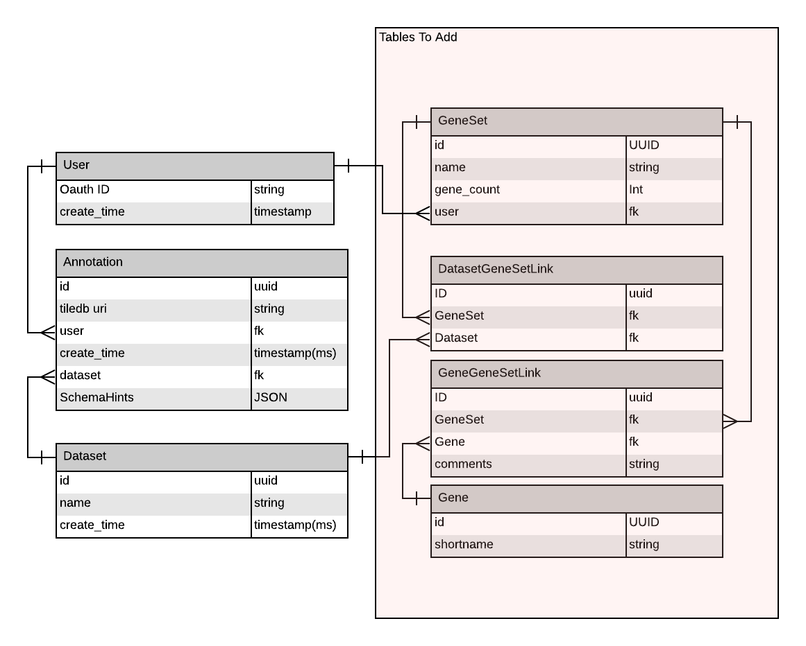

# Gene Sets Data Format

## [Optional] Subtitle of my design 

**Authors:** [Madison Dunitz](mailto:madison.dunitz@chanzuckerberg.com)

**Approvers:** [Friendly Tech Person](mailto:some.nice.person@chanzuckerberg.com), [Friendly PM Person](mailto:some.nice.person@chanzuckerberg.com), [Friendly Tech Person2](mailto:some.nice.person@chanzuckerberg.com), [Girish Patangay](mailto:girish.patangay@chanzuckerberg.com), [Sara Gerber](mailto:sara.gerber@chanzuckerberg.com) 

## tl;dr 

This RFC contains the details about the data format for the gene set feature. It will support the export of differential
 expression results and allow a user to upload their own gene sets for analysis. 
 
## Glossery 
- Gene set - List of genes
- Differential expression - A statistic (typically logfold and p-value) describing the difference in gene expression between two sets of cells. It may refer to stats specific to one gene (differential expression value) or many (differential expression analysis). When referring to many genes it is typically capped (eg top 10 most differentially expressed genes)
- LogFold - A ratio of the difference in expression levels. Typically calculated by taking the log2 of the gene expression value for each cell and then finding the mean of that value for each set of cells. Because the data is already log2 transformed you can then take the difference between the two means as the logfold value 
## Problem Statement | Background

Gene sets are the expected output of differential expression analysis in cellxgene. Two (non-overlaping) sets of cells 
are selected and the difference in the expression level for each gene is computed by comparing the average 
expression level for each set of cells. When there is a particularly large difference in expression between the two sets of 
cells, that gene is identified and presented to the user. To ensure consistency and compatibility it is necessary to define a 
data format for storing references to these genes and any accompanying statistical data. 

## [Optional] Product Requirements
### Users should be able to export differential expression results
Currently cellxgene users can choose two sets of cells and compute/display the log fold and adjusted p-value of the top ten differentially expressed genes. Additionally we display a histogram of the gene expression levels of the selected cells for each gene in the right side bar. 
- [US1] A user should be able to export the list of 10 genes along with their logfold and adjusted p-values in a csv file (see data formats below for more detail) by clicking a button
### Users should be able to upload their own gene sets and see them in the right side bar with the option to apply them within current cellxgene functionalities, if the same gene ontology was used when generating the current dataset and the geneset uploaded by the user (ie the gene names match) 
- [US2]  A user should be able to upload a geneset via a csv file (see data formats below for more detail) for a dataset
- [UC3] When a user uploads a geneset, that list of genes should appear in the right side bar 
- [US4] If the user was logged in when they uploaded a geneset that genesit should persist if they logout and back in or reload the page
- [US5] If the gene names match those used in the dataset the user should be able to use general cellxgene functionality (color by genes, calculate differential expression levels, etc.) on those genes
- [US6] Genesets uploaded for one dataset should be available in other datasets?

### If there is a standard format for differential expression output, we should follow that. If not, the format should be as straightforward as possible while serving these above cases.

### [Optional] Nonfunctional requirements
- Users should be able to export precomputed differential expression results in real time
- Users should be able to upload gene sets and have them immediately appear in the right side bar

## Detailed Design | Architecture | Implementation


### [Optional] Data model

Fully supporting persistence of differential expression results is out of the scope of this RFC. But the data model described below has been designed to allow for differential expression persistence in the future.
###Relational Database
To support gene sets four tables will be added to the cellxgene relational database
- Gene
   - UUID (generated)
   - GeneName
   - OntologyId?
- GeneGeneSetLink
   - UUID
   - Gene UUID
   - GeneSet UUID
   - Comments (optional)
- GeneSet
   - UUID (generated)
   - GeneSet Name (required)
   - Gene Count (generated)
   - Comments (optional, only available when the gene set is generated by cellxgene)
- GeneSetUserLink
   - User UUID
   - GeneSet UUID
   - Comments (optional)
   - Dataset UUID (?)


**Figure 1** Cellxgene data schema, tables to be added (as described above) are in red
#### Imported CSV
GeneSet CSV
- A file containing a comma separated list of the gene set name, genes and (optionally) details about why they were included. Each gene should be on a new line.
```
GENESET,GENE,COMMENTS
SET1, a23,I picked this gene because I think it causes cancer
SET1, b46,I picked this gene because I think it prevents cancer
SET2, c19,I picked this gene because it has a funny name
SET2, d57,
```
#### Exported CSV
Exported File
-  A file containing a comma separated list of genes, logfold values and p-values. The name of the directory storing the file will reference the dataset and the name of the file will contain names of the cell sets being compared, see datasetID/categoryA.label1-categoryB.label2.csv for an examole
In the future, if cells from two different datasets are being compared the dataset id will be appended as a prefix to the category names in the filename (?will this make the filename too long?)
```
GENE,PVALUE,LOGFOLD
a23,0.03,3
b46,0.02,2
c19,0.05,1
```

## [Optional] Alternatives

One simplifying alternative is to have the format of the exported and the imported csvs match. 
However this doesnt match described use cases or user behavior. Logfold and P-values were left out of the imported csv 
because those statistics are only meaningful when they are alongside information on what cell sets are being compared. We 
expect many of our user's gene sets to come from external papers without the accompanying data that would make those numbers useful. 

## References
